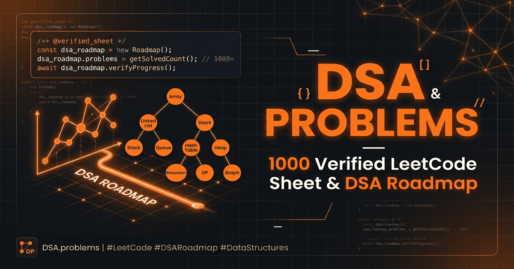

# 🚀 DSA Problems — 1000 Verified LeetCode Sheet & DSA Roadmap

> **Master 1,000 Curated Data Structures & Algorithms Problems from Beginner to FAANG-Ready.**

[](https://www.dsaproblems.site/)
[](https://www.dsaproblems.site/problems)
[](https://www.dsaproblems.site/)
[](LICENSE)

---



## 📌 Overview

[**DSA Problems (dsaproblems.site)**](https://www.dsaproblems.site/) is a free, developer-focused Data Structures & Algorithms learning platform and problem sheet featuring **1,000 curated LeetCode questions** organized by concept dependencies and core pattern recognition.

Whether you're starting your programming journey or prepping for top-tier software engineering interviews at FAANG / Big Tech companies, **DSA Problems** provides a smooth, interleaved progression from basic array manipulation to advanced dynamic programming and graph algorithms.

---

## ✨ Key Features

- 🎯 **1,000 Verified LeetCode Problems**: Exactly 200 Easy, 500 Medium, and 300 Hard questions.
- ⚡ **20+ Core DSA Patterns**: Structured coverage of Two Pointers, Sliding Window, Monotonic Stack, Binary Search, Trees, Graphs, Dynamic Programming, Backtracking, and Tries.
- 💻 **Multi-Language Solutions**: Verified solution code for every problem in **C++**, **Java**, **Python**, and **JavaScript** with Time and Space Complexity breakdowns.
- 🔒 **Zero Tracking & Privacy-First**: 100% free with no mandatory account registration. Progress, bookmarks, and notes are saved directly in your web browser (`localStorage`).
- 📱 **Mobile & Desktop Responsive**: Clean dark theme design optimized for fast loading and seamless reading across desktop, tablet, and mobile devices.
- 📊 **Progress Analytics**: Built-in visual dashboard tracking your topic-wise mastery, completion percentages, and daily streak.

---

## 📊 Curriculum Breakdown

| Difficulty | Problem Count | Description | Target Level |
| :--- | :---: | :--- | :--- |
| 🟢 **Easy** | **200** | Fundamental syntax, Array/String manipulation, Two Pointers, Basic Recursion | Beginner → Intermediate |
| 🟡 **Medium** | **500** | Core Interview Patterns, Binary Search, Trees, Graphs, DP, Sliding Window | Intermediate → FAANG Ready |
| 🔴 **Hard** | **300** | Advanced DP, Graph TopoSort, Segment Trees, Hard Backtracking & Tries | Advanced → Senior / Top Tech |

---

## 🛠️ Local Development & Setup

Run the site locally using any static HTTP web server:

```bash
# Clone the repository
git clone https://github.com/hashmiii14/100DSAQUETIONS.git

# Navigate to project directory
cd 100DSAQUETIONS

# Serve static files locally
npx serve .
```

Open `http://localhost:3000` in your web browser.

---

## 🌟 Support & Contribute

If you find **DSA Problems** helpful for your interview preparation:
- ⭐ **Star this repository** on GitHub!
- 🌐 Visit and bookmark the live site: [**dsaproblems.site**](https://www.dsaproblems.site/)
- 📢 Share it with your friends, classmates, and tech communities!

---

© 2026 [DSA Problems](https://www.dsaproblems.site/) — Built for Software Engineers & Competitive Programmers.
